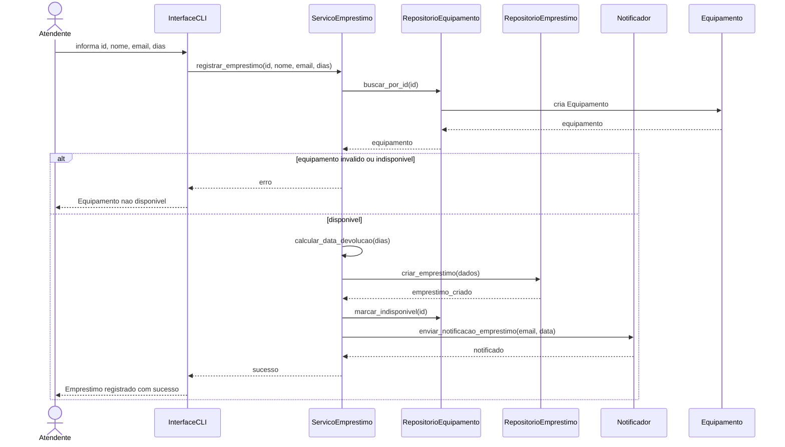
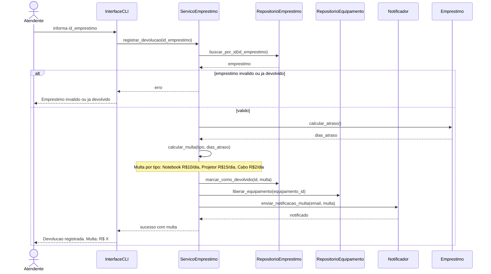
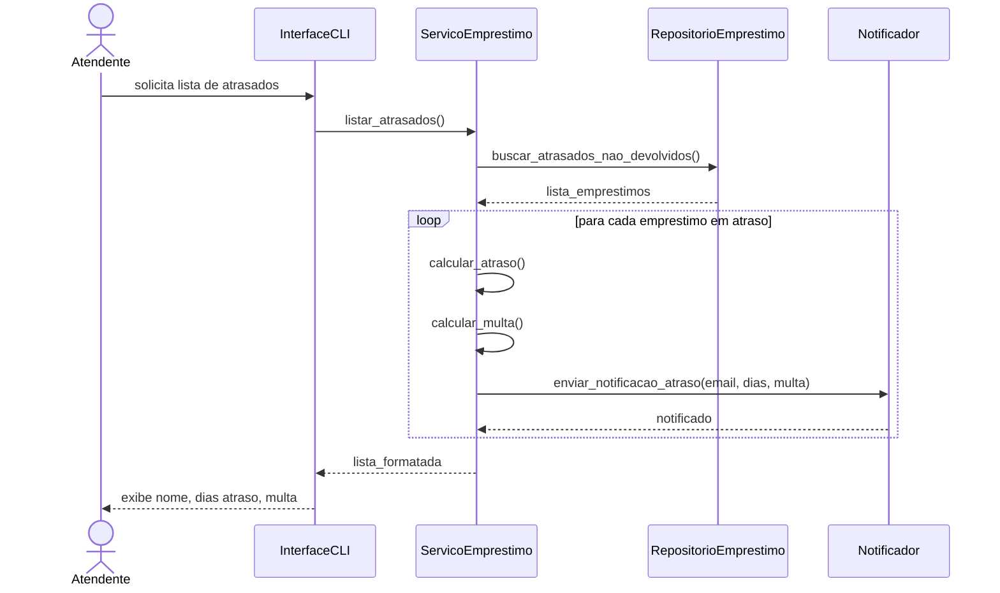

# Documento de Design — Sistema de Empréstimos v2.0

**Disciplina:** Engenharia de Software II  
**Aluna:** Caroline Silva Santos  
**Data:** 06/05/2026  

## Decomposição em camadas

A decomposição segue os princípios de **SRP (um motivo para mudar por classe)** e **separação por camadas**, conforme ADR-001.

### Camada models (domínio puro)

| Classe | Motivo para mudar | Por que mora aqui? |
|--------|------------------|----------------------|
| `Equipamento` | Alteração nos atributos de um equipamento (nome, tipo, disponibilidade) | Representa um conceito do domínio, sem regras de negócio ou persistência. Alta coesão. |
| `Emprestimo` | Alteração nos dados de um empréstimo (datas, status, multa) | Mesmo princípio: apenas estrutura de dados do domínio. Isola o que o negócio entende por "empréstimo". |

---

### Camada services (lógica de aplicação)

| Classe | Motivo para mudar | Por que mora aqui? |
|--------|------------------|----------------------|
| `ServicoEmprestimo` | Regras de negócio de empréstimo (cálculo de multa, validação de disponibilidade, etc.) | Coordena os casos de uso. Aplica SRP: só contém lógica de negócio, sem interface ou persistência. |
| `Notificador` | Troca de canal de notificação (ex.: e-mail → SMS) ou template de mensagem | Responsabilidade única: enviar mensagens. Mudanças externas (provedor de e-mail, formato) ficam aqui. |

---

### Camada repositories (acesso a dados)

| Classe | Motivo para mudar | Por que mora aqui? |
|--------|------------------|----------------------|
| `RepositorioEquipamento` | Troca de fonte de dados (lista → banco → API) | Esconde a estrutura de dados interna. Cliente chama `buscar_por_id()` sem saber se é dict, SQL, etc. |
| `RepositorioEmprestimo` | Troca de persistência ou mudança no esquema de armazenamento | Mesmo princípio de ocultamento. Listas internas são privadas (`_emprestimos`). |

---

### Camada interface (interação com usuário)

| Classe | Motivo para mudar | Por que mora aqui? |
|--------|------------------|----------------------|
| `CLI` | Alteração no formato do menu, mensagens, ou fluxo de entrada/saída | Isola completamente a apresentação. A classe `Sistema` original violava SRP ao misturar menu com regras de negócio. |

---

### Inicialização

| Arquivo | Motivo para mudar | Por que mora aqui? |
|---------|------------------|----------------------|
| `main.py` | Mudança na forma de instanciar dependências (ex.: injeção de dependência) | Única responsabilidade: montar o sistema e iniciar. Nenhuma lógica de domínio. |

---

## Diagramas de sequência

### UC01 — Registrar Empréstimo

### UC02 — Registrar Devolução

### UC03 — Listar Empréstimos em Atraso

